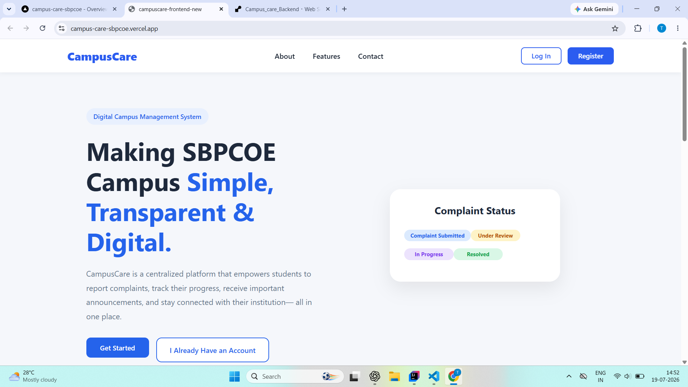
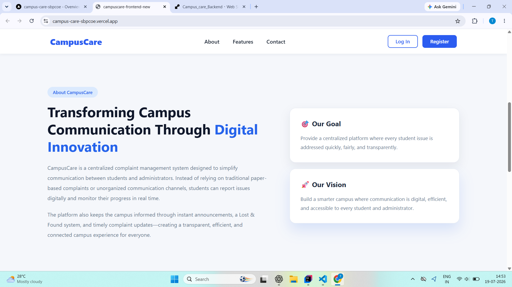
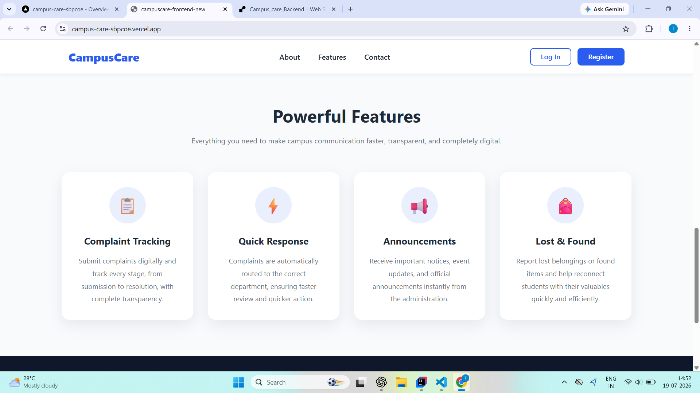
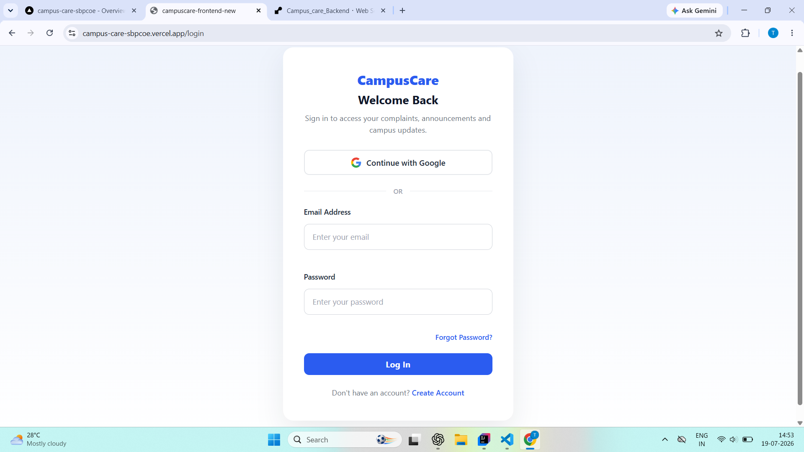
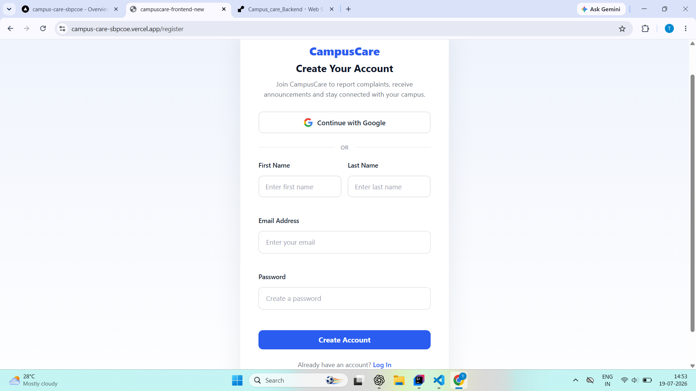
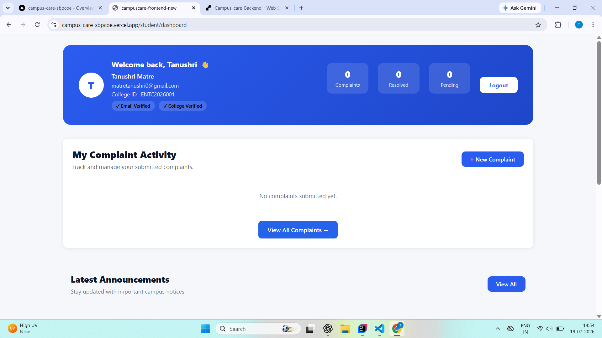
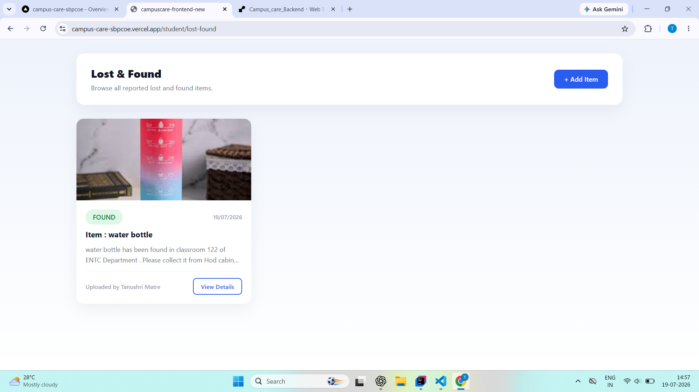

# 🎓 Campus Care - Frontend

A modern React-based frontend for **Campus Care**, a Complaint & Campus Management System that enables students and administrators to efficiently manage complaints, announcements, and lost & found items through a secure and responsive web interface.


## 📖 Project Overview

Campus Care is a full-stack web application developed to simplify communication between students and college administrators.

The frontend provides an intuitive and responsive interface where students can register, authenticate securely, submit complaints, browse announcements, report lost & found items, and offer feedback. Administrators can monitor complaints, publish announcements, and manage campus activities through dedicated dashboards.

This repository contains the React + Vite frontend application that communicates with the Spring Boot backend using REST APIs.

## ✨ Key Features

### 🔐 Authentication

- Student Registration
- Email OTP Verification
- Secure Login
- Google OAuth Login
- Forgot Password
- Protected Routes

### 👨‍🎓 Student Features

- Interactive Dashboard
- Submit Complaints
- Track Complaint Status
- View Complaint History
- Lost & Found Management
- View Announcements
- Feedback

### 👨‍💼 Admin Features

- Admin Dashboard
- Complaint Management
- Update Complaint Status
- Upload Announcements


## 🛠️ Tech Stack

| Category       | Technologies       |
|----------------|--------------------|
| Framework      | React 19           |
| Build Tool     | Vite               |
| Routing        | React Router DOM   |
| HTTP Client    | Axios              |
| Styling        | CSS3               |
| Icons          | React Icons        |
| Charts         | Recharts           |
| Authentication | JWT + Google OAuth |
| Deployment     | Vercel             |


## 📁 Project Structure


src/
├── admin/         # Admin-specific pages and components

├── api/           # Axios API services

├── auth/          # Authentication pages and utilities

├── components/    # Reusable UI components

├── context/       # React Context providers

├── layouts/       # Shared application layouts

├── pages/         # General application pages

├── routes/        # Route configuration & protection

├── student/       # Student-specific modules

├── App.jsx

└── main.jsx


## 📋 Prerequisites

Before running the frontend locally, ensure you have the following installed:

- Node.js (v18 or later)
- npm (comes with Node.js)
- Git
- A running Campus Care backend server

The frontend communicates with the backend through REST APIs, so the backend must be running or accessible via a deployed URL.


## 🚀 Installation

Follow these steps to set up the Campus Care frontend locally.

### 1. Clone the repository

```bash
git clone https://github.com/Tanushri014/campus-care-frontend.git
```

### 2. Navigate to the project directory

```bash
cd campus-care-frontend
```

### 3. Install dependencies

```bash
npm install
```

### 4. Configure environment variables

Copy the example environment file:

```bash
cp .env.example .env
```

Update the values in the `.env` file according to your backend configuration.

### 5. Start the development server

```bash
npm run dev
```

The application will be available at:

```text
http://localhost:5173
```


## 🌐 Live Demo

> **Frontend:** https://campus-care-sbpcoe.vercel.app

> **Note:** Since the backend is hosted on Render's free tier, the initial request may take 30–60 seconds while the server wakes up.


Landing page




Login page


Register page


Dashboard




